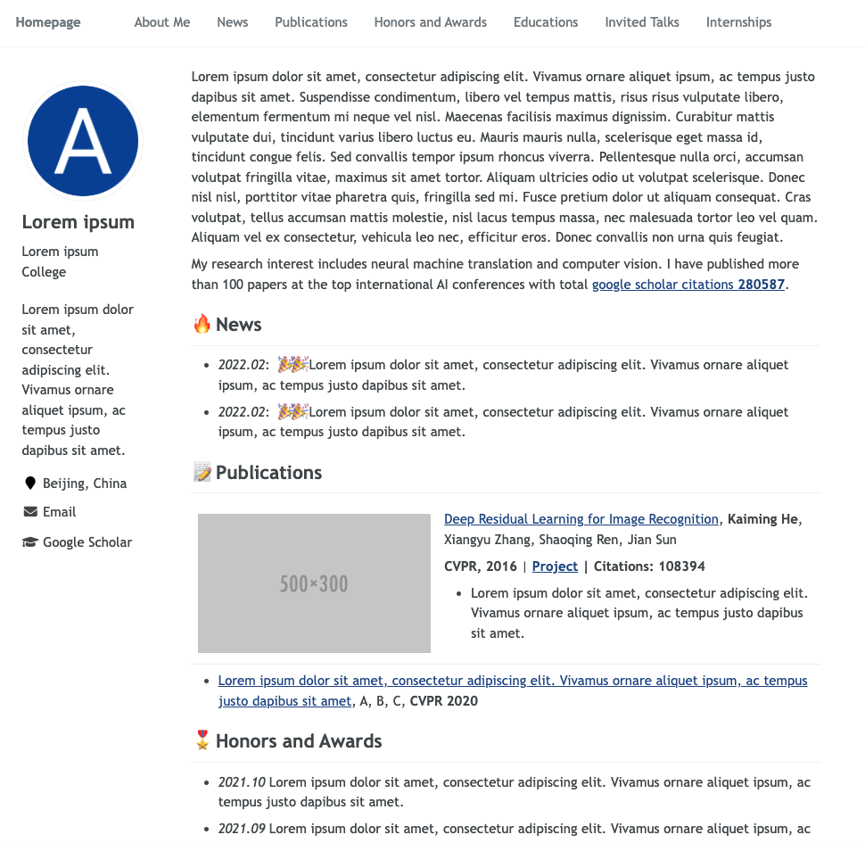

<h1 align="center">
AcadHomepage
</h1>

  | [English README](../README.md) 

一个现代、响应式的个人学术主页

     
    
     

一些例子：
- [样例页面](https://rayeren.github.io/acad-homepage.github.io/)
- [作者的个人主页](https://rayeren.github.io/)

## 主要特点
- **自动更新谷歌学术引用**: 借助谷歌学术爬虫和github action功能，本仓库可以自动更新作者的引用数和论文引用数。
- **支持谷歌Analytics**: 你可以通过简单的配置来实现使用谷歌Analytics跟踪网页的流量。
- **响应式的**: 此主页会针对不同的屏幕尺寸自动调整布局。
- **美观而简约**: 此主页美观而简约，适合个人学术主页的搭建。
- **搜索引擎优化**: 搜索引擎优化 (SEO) 帮助搜索引擎轻松找到您在主页上发布的信息，然后将其与类似网站进行排名，并获得排名优势。

## 快速开始

1. Fork本仓库到`USERNAME/USERNAME.github.io`，其中`USERNAME`是你的github用户名。
1. 配置谷歌学术引用爬虫：
    1. 在你的谷歌学术引用页面的url里找到你的谷歌学术ID：例如，在url https://scholar.google.com/citations?user=SCHOLAR_ID 中，`SCHOLAR_ID`部分即为你的谷歌学术ID。
    1. 在github本仓库页面的`Settings -> Secrets -> Actions -> New repository secret`中，添加`GOOGLE_SCHOLAR_ID`变量：`name=GOOGLE_SCHOLAR_ID`、`value=SCHOLAR_ID`。
    1. 在github本仓库页面的`Action`中，点击*"I understand my workflows, go ahead and enable them"*启用workflows by clicking *"。本action将会谷歌学术引用的统计量数据`gs_data.json`到本仓库的`google-scholar-stats`分支中。每次修改main分支的内容会触发该action。本action也会在每天08:00 UTC定时触发。
1. 使用 [favicon-generator](https://redketchup.io/favicon-generator)生成favicon（网页icon文件），并下载所有文件到`REPO/images`。
1. 修改主页配置文件[_config.yml](../_config.yml):
    1. `title`: 主页标题
    1. `description`: 主页的描述
    1. `repository`: USER_NAME/REPO_NAME  
    1. `google_analytics_id` (可选的): 谷歌Analytics ID
    1. SEO相关的键值 (可选的): 从搜索引擎的控制台里获得对应的ID (例如：Google, Bing and Baidu)，然后粘贴到这里。
    1. `author`: 主页作者信息，包括其他网页、Email、所在城市、大学等。
    1. `google_scholar_stats_use_cdn`: 使用CDN读取存储于`https://raw.githubusercontent.com/`的google scholar引用统计数据，防止中国大陆地区被墙无法访问的情况。但是CDN有缓存，因此`google_scholar_stats_use_cdn : True`时，引用数据更新会有延迟。
    1. 更多的配置信息在注释中有详细描述。
1. 将你的主页内容添加到 [_pages/about.md](../_pages/about.md).
1. 你的主页将会被部署到`https://USERNAME.github.io`.

## 本地调试

1. 使用`git clone`将本项目克隆到本地。
1. 安装Jekyll的构建环境，包括`Ruby`、`RubyGems`、`GCC`和`Make`。可参考[该教程](https://jekyllrb.com/docs/installation/#requirements)。
1. 运行 `bash run_server.sh` 来启动Jekyll实时重载服务器。
1. 在浏览器里打开 [http://127.0.0.1:4000](http://127.0.0.1:4000)。如果你修改了网页的源码，服务器会自动重新编译并刷新页面。
1. 当你修改完毕你的页面以后, 使用`git`命令，`commit`你的改动并`push`到你的github仓库中。

# Acknowledges

- AcadHomepage incorporates Font Awesome, which is distributed under the terms of the SIL OFL 1.1 and MIT License.
- AcadHomepage is influenced by the github repo [mmistakes/minimal-mistakes](https://github.com/mmistakes/minimal-mistakes), which is distributed under the MIT License.
- AcadHomepage is influenced by the github repo [academicpages/academicpages.github.io](https://github.com/academicpages/academicpages.github.io), which is distributed under the MIT License.